#############################################
Zihni Beğburs tarafından Gerçeklenen Kısımlar
#############################################

Kullanıcı siteye şifre ve e-postasıyla giriş yaptıktan sonra profil sayfasına tıklayarak profil bilgileri üzerinde işlem yapabileceği sayfaya erişir.
Bu sayfa 3 ana tablodan oluşur. Bu tablolar eğitim bilgileri, tecrübe bilgileri ve dil bilgilerini içeren tablolardır. Kullanıcı bu sayfada bu bilgiler üzerinde
Ekleme,Arama,Silme ve Düzenleme işlemlerini gerçekleştirebilir.

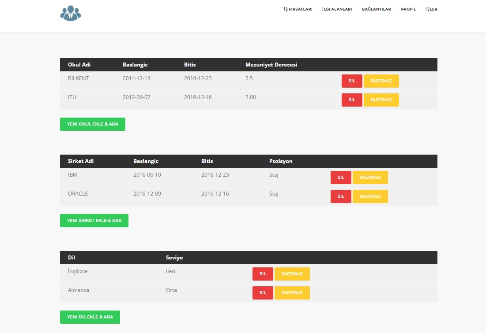

      *Ekran Görüntüsü 1: Profil Sayfası*

1.Eğitim Tablosu ve İşlemler
============================

Bu tablo kişini eğitim bilgilerini içeren tablodur.

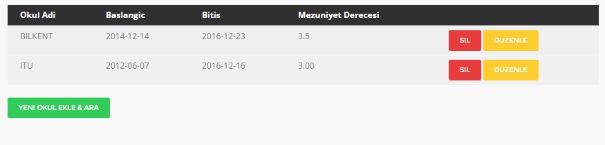

      *Ekran Görüntüsü 2: Eğitim Tablosu*

Bu tabloda tutulan bilgiler: okul adı, başlangıç tarihi, bitiş tarihi ve not bilgileridir.
Kullanıcı bu tabloda eğitim bilgisi ekleyebilir, düzenleyebilir , silebilir ve arama işlemi gerçekleştirebilir.

1.1.Ekleme İşlemi
-----------------

Kullanıcı yeni bir eğitim bilgisi girmek istediğinde tablonun hemen altındaki "YENI OKUL EKLE & ARA" butonuna tıklar. Tıkladıktan sonra tablonun altına açılan formda
kullanıcı okul adı, başlangış tarihi, bitiş tarihi ve not bilgilerini girerek "EKLE" butonuna tıklar.

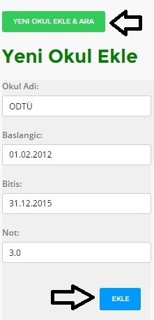

      *Ekran Görüntüsü 3: Eğitim Tablosu Ekleme*

Böylece girilen bilgiler tabloya eklenmiş olur ve tabloda gözlemlenebilir.

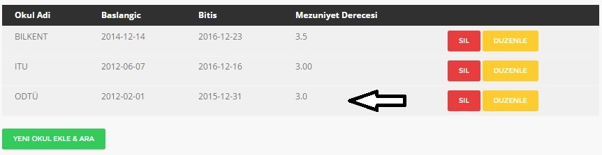

      :scale: 100 %

      *Ekran Görüntüsü 4: Eğitim Tablosu Ekleme Sonrası*

1.2.Silme İşlemi
----------------

Kullanıcı eğitim tablosundaki herhangi bir bilgiyi silmek istediğinde eğitim bilgisinin sağ tarafındaki ona ait olan "SİL" butonuna tıklayarak veriyi tablodan siler.

.. figure:: zihni/EğitimTablosuSilme.jpg
      :scale: 100 %

      *Ekran Görüntüsü 5: Eğitim Tablosu Silme*

Silme işleminden sonra bilginin tabloda olmadığı gözlemlenir.

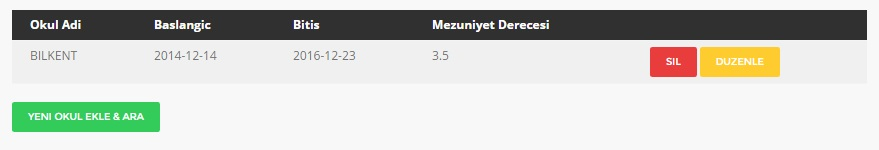

      *Ekran Görüntüsü 6: Eğitim Tablosu Silme Sonrası*

1.3.Düzenleme İşlemi
--------------------

Kullanıcı eğitim tablosundaki herhangi bir bilgiyi düzenlemek istediğinde eğitim tablosunun sağ tarafındaki "DÜZENLE" butonuna tıklar.

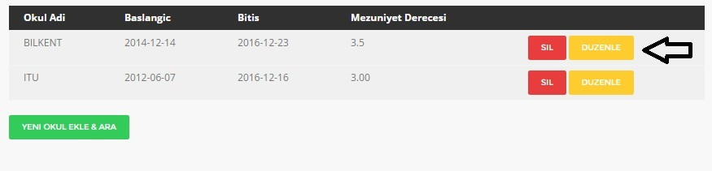

      *Ekran Görüntüsü 7: Eğitim Tablosu Düzenleme*

Tıklamadan sonra kullanıcı düzenleme sayfasına yönlendirilir.

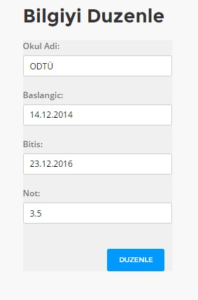

      *Ekran Görüntüsü 8: Eğitim Tablosu Düzenleme Sayfası*

Düzenleme sayfasında kullanıcı değiştirmek istediği eğitim bilgisinin verilerini görür ve değiştirmek istediği veri veya verileri değiştirerek "DÜZENLE" butonuna tıklar. Tıklamadan sonra kullanıcı tekrar profil sayfasına yönlendirilir ve düzenlediği bilgiyi gözlemleyebilir.

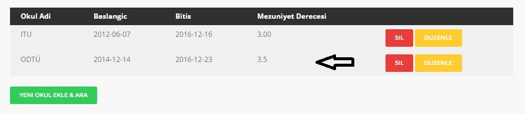

      *Ekran Görüntüsü 9: Eğitim Tablosu Düzenleme Sonrası*

1.4.Arama İşlemi
----------------

Kullanıcı eğitim tablosundaki bilgilerda arama yapmak istedğinde tablonun hemen altındaki "YENI OKUL EKLE & ARA" butonuna tıklar. Tıkladıktan sonra tablonun altına açılan formda
kullanıcı bulmak istediği eğitim bilgisi için "Okul Ara" başlığı altındaki alana okul adını girer ve daha sonra "ARA" butonuna tıklar.

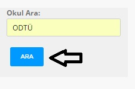

      *Ekran Görüntüsü 10: Eğitim Tablosu Arama*

Tıklamadan sonra kullanıcı eğitim tablosunda sonuçları gözlemleyebilir.

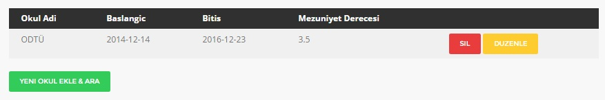

      *Ekran Görüntüsü 11: Eğitim Tablosu Arama Sonrası*

2.Tecrübe Tablosu ve İşlemler
=============================

Bu tablo kişini tecrübe bilgilerini içeren tablodur.

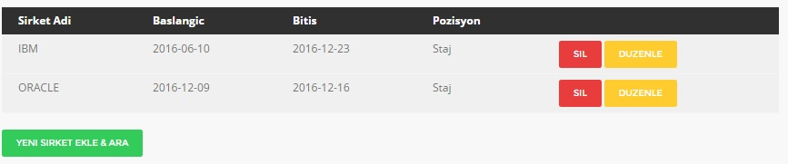

      *Ekran Görüntüsü 12: Tecrübe Tablosu*

Bu tabloda tutulan bilgiler: şirket adı, başlangıç tarihi, bitiş tarihi ve pozisyon bilgileridir.
Kullanıcı bu tabloda tecrübe bilgisi ekleyebilir, düzenleyebilir , silebilir ve arama işlemi gerçekleştirebilir.

2.1.Ekleme İşlemi
-----------------

Kullanıcı yeni bir tecrübe bilgisi girmek istediğinde tablonun hemen altındaki "YENI ŞİRKET EKLE & ARA" butonuna tıklar. Tıkladıktan sonra tablonun altına açılan formda
kullanıcı şirket adı, başlangıç tarihi, bitiş tarihi ve pozisyon bilgilerini girerek "EKLE" butonuna tıklar.

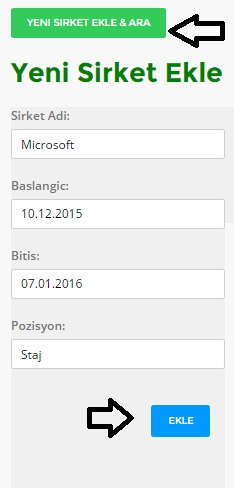

      *Ekran Görüntüsü 13: Tecrübe Tablosu Ekleme*

Böylece girilen bilgiler tabloya eklenmiş olur ve tabloda gözlemlenebilir.

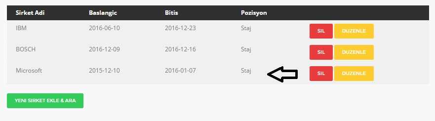

      *Ekran Görüntüsü 14: Tecrübe Tablosu Ekleme Sonrası*

2.2.Silme İşlemi
----------------

Kullanıcı tecrübe tablosundaki herhangi bir bilgiyi silmek istediğinde tecrübe bilgisinin sağ tarafındaki ona ait olan "SİL" butonuna tıklayarak veriyi tablodan siler.

.. figure:: zihni/TecrübeTablosuSilme.jpg
      :scale: 100 %

      *Ekran Görüntüsü 15: Tecrübe Tablosu Silme*

Silme işleminden sonra bilginin tabloda olmadığı gözlemlenir.

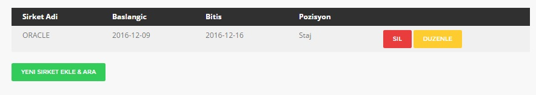

      *Ekran Görüntüsü 16: Tecrübe Tablosu Silme Sonrası*

2.3.Düzenleme İşlemi
--------------------

Kullanıcı tecrübe tablosundaki herhangi bir bilgiyi düzenleme istediğinde tecrübe tablosunun sağ tarafındaki "DÜZENLE" butonuna tıklar.

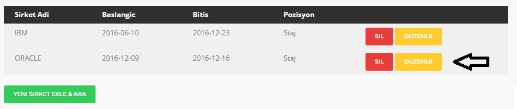

      *Ekran Görüntüsü 18: Tecrübe Tablosu Düzenleme Sayfası *

Tıklamadan sonra kullanıcı düzenleme sayfasına yönlendirilir.

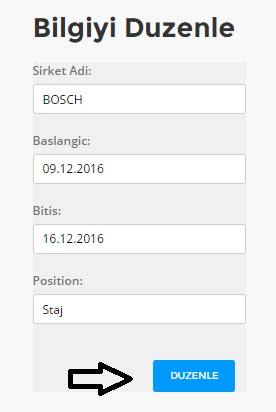

      *Ekran Görüntüsü 18: Tecrübe Tablosu Düzenleme Sayfası *

Düzenleme sayfasında kullanıcı değiştirmek istediği tecrübe bilgisinin verilerini görür ve değiştirmek istediği veri veya verileri değiştirerek "DÜZENLE" butonuna tıklar. Tıklamadan sonra kullanıcı tekrar profil sayfasına yönlendirilir ve düzenlediği bilgiyi gözlemleyebilir.

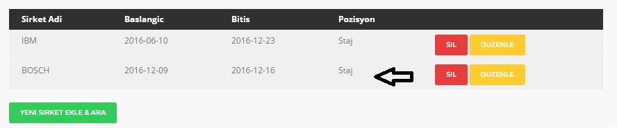

      *Ekran Görüntüsü 19: Tecrübe Tablosu Düzenleme Sonrası *

2.4.Arama İşlemi
----------------

Kullanıcı tecrübe tablosundaki bilgilerda arama yapmak istedğinde tablonun hemen altındaki "YENI ŞİRKET EKLE & ARA" butonuna tıklar. Tıkladıktan sonra tablonun altına açılan formda
kullanıcı bulmak istediği tecrübe bilgisi için "Şirket Ara" başlığı altındaki alana şirket adını girer ve daha sonra "ARA" butonuna tıklar.

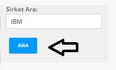

      *Ekran Görüntüsü 20: Tecrübe Tablosu Arama*

Tıklamadan sonra kullanıcı tecrübe tablosunda sonuçları gözlemleyebilir.

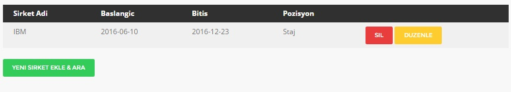

      *Ekran Görüntüsü 21: Tecrübe Tablosu Arama Sonrası*

3.Dil Tablosu ve İşlemler
=========================

Bu tablo kişini dil bilgilerini içeren tablodur.

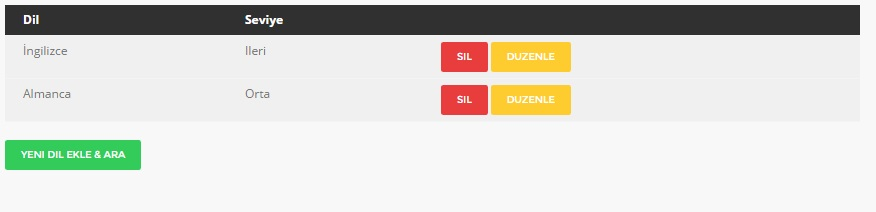

      *Ekran Görüntüsü 22: Dil Tablosu*

Bu tabloda tutulan bilgiler: dil ve seviye bilgileridir.
Kullanıcı bu tabloda dil bilgisi ekleyebilir, düzenleyebilir , silebilir ve arama işlemi gerçekleştirebilir.

3.1.Ekleme İşlemi
-----------------

Kullanıcı yeni bir dil bilgisi girmek istediğinde tablonun hemen altındaki "YENİ DİL EKLE & ARA" butonuna tıklar. Tıkladıktan sonra tablonun altına açılan formda
kullanıcı dil ve seviye bilgilerini girerek "EKLE" butonuna tıklar.

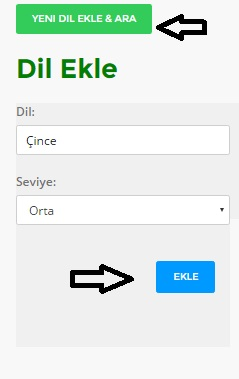

      *Ekran Görüntüsü 23: Dil Tablosu Ekleme*

Böylece girilen bilgiler tabloya eklenmiş olur ve tabloda gözlemlenebilir.

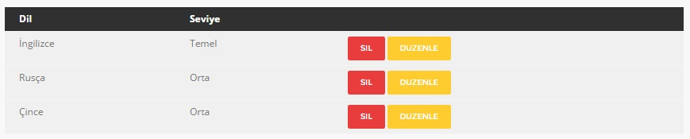

      *Ekran Görüntüsü 24: Dil Tablosu Ekleme Sonrası*

3.2.Silme İşlemi
----------------

Kullanıcı dil tablosundaki herhangi bir bilgiyi silmek istediğinde dil bilgisinin sağ tarafındaki ona ait olan "SİL" butonuna tıklayarak veriyi tablodan siler.

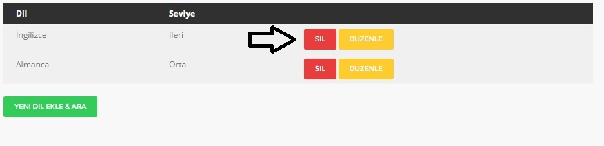

      *Ekran Görüntüsü 25: Dil Tablosu Silme*

Silme işleminden sonra bilginin tabloda olmadığı gözlemlenir.

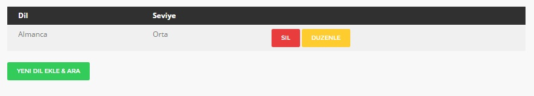

      *Ekran Görüntüsü 26: Dil Tablosu Silme Sonrası*

3.3.Düzenleme İşlemi
--------------------

 Kullanıcı dil tablosundaki herhangi bir bilgiyi düzenlemek istediğinde tecrübe tablosunun sağ tarafındaki "DÜZENLE" butonuna tıklar.

.. figure:: zihni/DilTablosuDüzenleme.jpg
      :scale: 100 %

      *Ekran Görüntüsü 27: Dil Tablosu Düzenleme*

Tıklamadan sonra kullanıcı düzenleme sayfasına yönlendirilir.

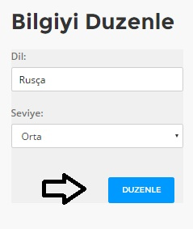

      *Ekran Görüntüsü 28: Dil Tablosu Düzenleme Sayfası*

Düzenleme sayfasında kullanıcı değiştirmek istediği dil bilgisinin verilerini görür ve değiştirmek istediği veri veya verileri değiştirerek "DÜZENLE" butonuna tıklar. Tıklamadan sonra kullanıcı tekrar profil sayfasına yönlendirilir ve düzenlediği bilgiyi gözlemleyebilir.

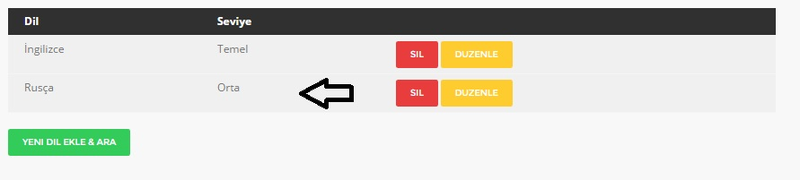

      *Ekran Görüntüsü 29: Dil Tablosu Düzenleme Sonrası*

3.4.Arama İşlemi
----------------

Kullanıcı dil tablosundaki bilgilerde arama yapmak istediğinde tablonun hemen altındaki "YENİ DİL EKLE & ARA" butonuna tıklar. Tıkladıktan sonra tablonun altına açılan formda
kullanıcı bulmak istediği dil bilgisi için "Dil Ara" başlığı altındaki alana dil adını girer ve daha sonra "ARA" butonuna tıklar.

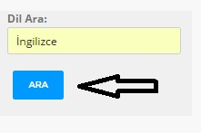

      *Ekran Görüntüsü 30: Dil Tablosu Arama *

Tıklamadan sonra kullanıcı dil tablosunda sonuçları gözlemleyebilir.

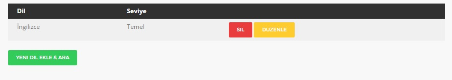

      *Ekran Görüntüsü 31: Dil Tablosu Arama Sonrası*
